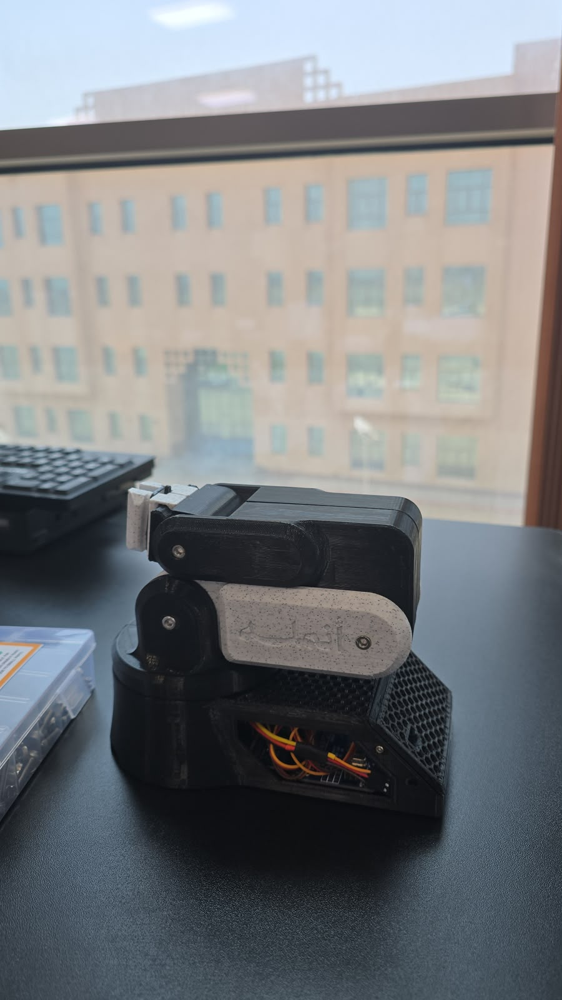
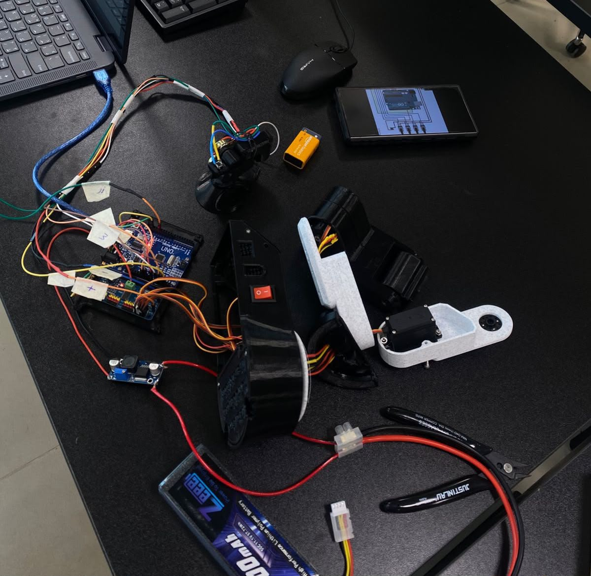
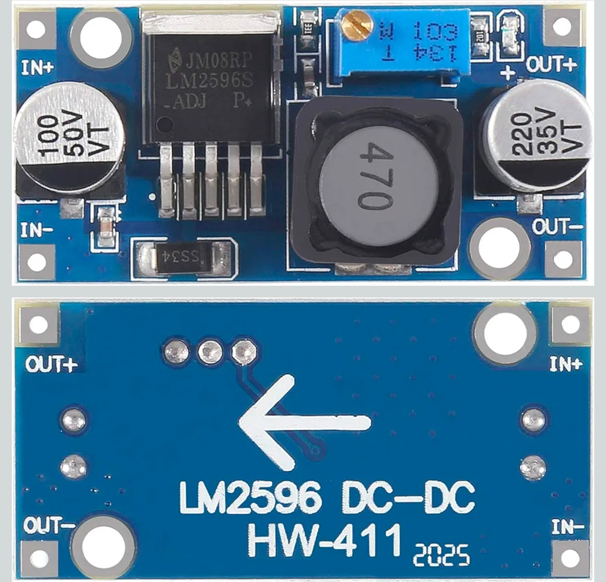

# "Anmalah" - Teleoperated Robotic Arm System

Anmalah is a 5-Degree of Freedom (DoF) teleoperated robotic arm built to demonstrate real-time motion control using microcontrollers and analog feedback systems. 

---

##  Hardware Architecture & Component Specifications
Instead of custom separate documentation, here is the official Bill of Materials (BOM) utilized for the control and structural network:

| Component | Purpose / Specification | Connection Protocol |
| :--- | :--- | :--- |
| **Microcontroller** | System Main Logic & Input Processing | Core GPIO Bus |
| **PCA9685 Driver** | 16-Channel 12-bit PWM Generation | I2C Protocol (`SDA/SCL`) |
| **Actuators (4x)** | High-Torque MG996R Servo Motors | PWM Signals |
| **Power Supply** | Zeee LiPo Battery (5200mAh) | External Power Rail |
| **Voltage Regulator**| Texas Instruments LM2596 (Adjustable) | Step-Down Buck DC-DC |
| **Chassis** | 3D Printed Custom Structural Joints | Mechanical PLA |

---

##  Circuit Integration & Signal Routing
To establish stable parallel communication with multiple actuators, a centralized signal routing layer was constructed.

* **I2C Multiplexing:** Power rails and logical signal paths were isolated during the wiring phase to protect input buses from inductive kickbacks from the motors.
* **Cable Management:** Power delivery networks were designed with heavy-gauge connections to support sudden current draws without heating or signal degradation.

---

##  Firmware Design & Optimization
The system's firmware incorporates optimization techniques to stabilize motion and enhance control response:
* **Analog Noise Filtering (Dead Zone):** Implemented a software-based threshold (`abs(currentVal - lastPotVals[index]) > 15`) to suppress potentiometer line jitter.
* **Edge Detection:** Tracks state-changes for digital inputs (Wrist toggles) to prevent redundant main loop cycles.
* **PWM Mapping:** Calibrated constraints (`133` min to `481` max) to lock servo sweeps within safe mechanical boundaries (0° - 180°).

---

##  Hardware Stress-Testing & The 80% System Challenge (The Core Find)

During laboratory stress-testing and joint calibration under active mechanical loads, the system reached a critical hardware bottleneck that capped initial deployment at an **80% operational milestone**.

###  The Problem: Stall Current & Voltage Drop
When multiple MG996R servos initiate motion simultaneously under the torque load of the 3D printed arm, they pull transient **Stall Currents** reaching up to 1.2A - 1.5A per motor. 
* This localized load quickly exceeded the safe operational thresholds of standard controller buses.
* This caused immediate thermal throttling and a massive **Voltage Drop** on the main rail, leading to micro-controller resets and stuttered servo behaviors.

###  The Analytical Solution (Data-Driven Isolation)
To diagnose the root cause, we cross-referenced our physical system behavior against the official **Texas Instruments LM2596 Simple Switcher Datasheet**:

The documentation states a strict limit of **3-A Continuous Output Load Current**. Our simultaneous load spiked past 4.5A, meaning the regulator was shifting into internal current-limit and thermal shutdown protection.

We solved this by designing a **Power Isolation Topology** using an adjustable LM2596 Buck Converter board:

We adjusted the on-board potentiometer to step down the LiPo battery voltage to a fixed **5V DC**, routing this power line *strictly* to the servo rails while maintaining a shared ground with the microcontroller. This completely isolated the logic signalling network from high-current drops.

###  Next Design Phase (Path to 100% Production)
To finalize the project for absolute high-stress reliability, the next implementation phase involves replacing the single LM2596 module with a higher-amperage switching regulator (such as the **XL4016 supporting up to 8A**) or deploying a dual-LM2596 rail system to split load distribution evenly.
